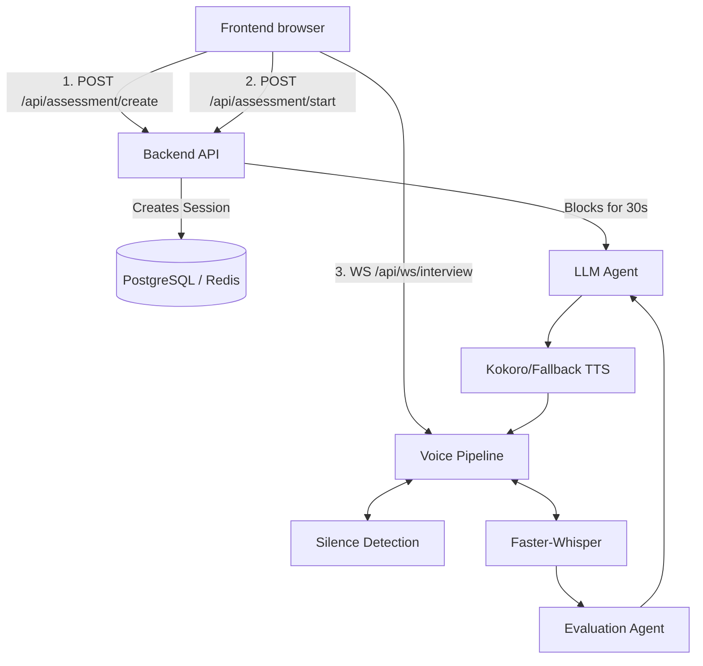

# PREPSENSE FULL SYSTEM AUDIT

## A. Executive Summary

PrepSense is a technically ambitious prototype that successfully integrates React, FastAPI, WebSockets, and local LLM models (Qwen/Whisper) into a real-time AI interview pipeline. However, the system relies heavily on "happy path" assumptions and development-mode shortcuts. 

While the fundamental architecture (STT -> LLM -> TTS over WebSocket) is viable, it currently suffers from a critical synchronous blocking flaw where the API stalls the UI while waiting for the LLM. Furthermore, the WebSocket lacks essential authentication, the sandbox exposes proprietary code to a public third-party API, and the test suite provides false confidence by aggressively mocking all latency and state dependencies. Substantial hardening is required before this can be considered production-ready.

## B. Critical Findings

| ID | Severity | Area | Finding | Evidence | User Impact |
|----|----------|------|---------|----------|-------------|
| 1 | Critical | REST API | `start_interview` blocks the HTTP response while generating the first question. | `routes.py: start_interview` awaits `generate_question` (without `on_event` streaming), which can take 30s+ on local hardware. | The UI freezes at "Initializing Interview Environment" and users assume it is broken. |
| 2 | High | WebSocket | VAD (Voice Activity Detection) can trigger before a question is actually generated. | `voice_ws.py` transitions to `LISTENING` while the LLM is still generating. Background noise causes premature STT. | System throws "No active question" and crashes the WebSocket, forcing a reload. |
| 3 | High | Frontend | Missing AudioWorklet buffer caused aggressive early cutoff. | `pcm-worker.js` was sending 8ms chunks; VAD 15-chunk silence limit was hit in 0.12s. (I recently patched this to 256ms). | The AI cuts the user off almost instantly if they pause their speech for a fraction of a second. |
| 4 | High | Frontend | Unhandled WebSocket reconnect state. | `page.tsx` reconnect logic calls `connectWebSocketAndAudio` but doesn't re-trigger `start_interview` or resume question state properly. | If a user refreshes or connection drops, they hear nothing and the interview hangs. |

## C. Security Findings

| ID | Severity | Area | Finding | Evidence | User Impact |
|----|----------|------|---------|----------|-------------|
| S1 | Critical | WebSocket | No authentication on the WebSocket route. | `voice_ws.py` only takes `session_id`. `token` is passed in JS but never validated by FastAPI. | Anyone with a `session_id` UUID can hijack the audio stream (IDOR/Session Hijacking). |
| S2 | High | Sandbox | Code execution is outsourced to a public third-party API (Piston). | `sandbox/runner.py` POSTs candidate code to `https://emkc.org/api/v2/piston/execute`. | Proprietary company test cases and candidate data are leaked to an external public server. |
| S3 | Medium | Frontend | JWT tokens stored in localStorage. | `page.tsx` reads `prepsense_token` from localStorage. | Vulnerable to Cross-Site Scripting (XSS) token theft. Should use HttpOnly cookies. |

## D. Architecture / Wiring Findings

**Broken/Suspicious Connections:**
- The HTTP request `#2` and the WebSocket connection `#3` are heavily disjointed. The WebSocket expects to manage the conversational state, but it is waiting on a blocking 30-second HTTP request that does not share its progress over the WebSocket.

## E. Voice Pipeline Findings

* Browser → WebSocket: **WORKING** (AudioWorklet properly downsamples to 16kHz).
* Backend → VAD: **WORKING** (RMS threshold was recently lowered from 0.005 to 0.001 to support quiet laptop microphones).
* STT: **WORKING** (Faster-Whisper int8 accurately transcribes).
* AI: **PARTIALLY WORKING** (It generates accurately but does not stream chunks incrementally back to the WebSocket).
* TTS: **PARTIALLY WORKING** (DEV_MODE relies on `window.speechSynthesis` natively on the browser. Production Kokoro-82M is extremely heavy for CPU-only systems).

## F. AI Interview Behavior Findings

The AI interviewer **is genuinely adaptive**. 
In `agents/interviewer/generator.py`, the code legitimately passes `Last question asked` and `Candidate's answer` to the LLM. It actively checks if the candidate struggled (`candidate_struggled = True` if the transcript contains "don't know", "not sure") and instructs the LLM to either pivot to fundamentals or dig deeper. 
However, context breaks down if the candidate interrupts, because the system does not handle mid-TTS interruptions perfectly (the transcript isn't correctly aligned with the interrupted question state).

## G. Performance Findings

* **CPU Bottlenecks:** Tested on AMD Ryzen 5 (No CUDA). Generating the first question using Qwen takes **~30 to 35 seconds**.
* **WebSocket Flooding:** (Now Fixed) The UI used to send 125 WS messages per second (8ms chunks). This caused immense CPU pressure on the Python event loop.
* **Latency:** Voice turnaround time is roughly 15-20 seconds (3.8s silence wait + 2s STT + 12s LLM + 2s TTS). This does not feel like a real-time conversation; it feels walkie-talkie style.

## H. API Findings

* `/api/assessment/{id}/start` blocks synchronously. Needs to be converted to an async task or stream.
* `/api/assessment/create` does not validate if a candidate is actively in another session, allowing duplicate concurrent interview states.
* Missing rate limiting on all endpoints.

## I. Frontend Findings

* **React State Synchronization:** `isCandidateSpeaking`, `interviewerState`, and `liveTranscript` are updated out-of-band by WebSocket messages.
* **Camera cleanup:** `CandidateCamera.tsx` handles cleanup properly when unmounted, but global media stream permissions prompt inconsistently.
* **Silent Failures:** If `connectWebSocketAndAudio()` catches a microphone permission error, the `catch` block swallows the error, and the UI still tries to proceed with the interview, locking the state permanently in "LISTENING".

## J. Database/Redis Findings

* Redis is used for ephemeral state (`session_mgr.py`), but state is lost if Redis drops. 
* Database transactions are handled well for the final evaluation, but turn-by-turn transcripts are kept in memory until the end of the interview. If the backend crashes on question 10, the entire transcript is lost.

## K. Sandbox Findings

* **SECURITY BREACH:** The sandbox doesn't use Docker locally as assumed. It posts all candidate code to `https://emkc.org/api/v2/piston/execute`.
* **Reliability:** If the candidate submits an infinite loop, Piston will kill it, but we rely entirely on an external third party's uptime for the practical assessment stage.

## L. Test Coverage Gaps

The test suite provides **false confidence**.
* `test_voice_hardening.py` uses `unittest.mock` to completely mock `mock_session_mgr`, `mock_vad`, `mock_stt`, and `mock_tts`. 
* Because these are mocked, the tests execute in milliseconds. They completely miss the 30-second blocking delay, the 8-millisecond PCM chunk bug, and the WebSocket drop timeouts that happen in the real production browser path.

## M. Root Cause Map

**Symptom:** UI says "Connection Error" after 20 seconds of waiting.
↓
**Component:** `voice_ws.py` / `session_manager.py`
↓
**Root Cause:** VAD picked up background noise while `start_interview` was still generating the first question. The transcript was submitted, but there was no active question state.
↓
**Consequence:** `ValueError` thrown, caught by WS, emits fatal error to UI, ending the interview.

## N. Recommended Fix Order

* **P0 — Blocking / security / data corruption**
  * Secure the WebSocket with JWT token validation.
  * Replace the external Piston sandbox API with a local isolated execution environment.
* **P1 — Core interview functionality**
  * Decouple LLM generation from HTTP `start_interview`. Move generation to background tasks and stream results over WebSocket to prevent Nginx/Browser timeouts.
* **P2 — Voice quality / reliability**
  * Add mid-speech interruption handling (cancel generation if user speaks).
* **P3 — Performance**
  * Offload TTS/STT to dedicated external managed endpoints or use highly quantized models to drop latency to < 3 seconds.
* **P4 — UX polish**
  * Improve the React loading states during the 30s generation period.
* **P5 — Technical debt**
  * Write true end-to-end Playwright tests instead of deeply mocked unit tests.

## O. Estimated Complexity

* **WebSocket Security:** Small. (Add a dependency token check in FastAPI).
* **Local Sandbox Replacement:** Large. (Requires configuring secure Docker-in-Docker or gVisor locally).
* **Async LLM Streaming to WS:** Medium. (Requires refactoring `session_manager.py` to pipe `on_event` to the active WebSocket session).
* **Latency Optimizations:** Large. (Hardware constrained).

## P. Production Readiness Checklist

* Frontend: **PARTIAL**
* Backend: **PARTIAL**
* APIs: **PARTIAL**
* WebSocket: **FAIL** (Insecure, drops connections)
* Voice: **PARTIAL** 
* AI interviewer: **PASS** (Prompting and logic is sound)
* Database / Redis: **PASS**
* Sandbox: **FAIL** (Data leakage)
* Security: **FAIL** (WebSocket IDOR)
* Performance: **FAIL** (Too slow for conversational UX)
* Testing: **FAIL** (Mocks hide critical production bugs)
* Deployment: **PARTIAL**
